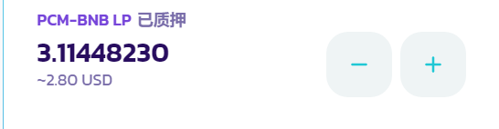
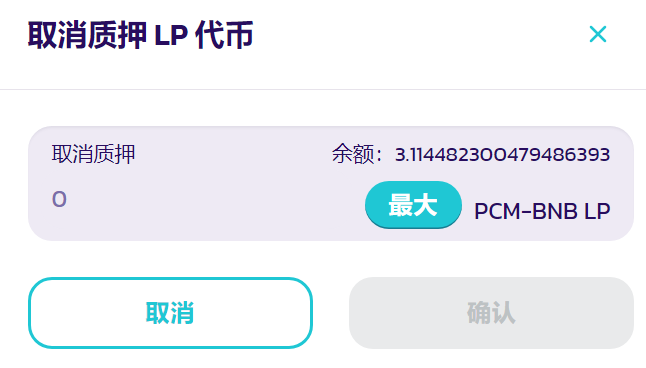

# 如何使用农场

\
在农场进行产量养殖是在PCMSwap上获得PCM奖励的一种好方法。

与糖浆池不同，农场需要您在两个代币上下注才能获得LP代币，然后您在农场上下注以获得奖励。这让你在赚取PCM的同时仍能在其他代币中占有一席之地！

与糖浆池相比，高产农业可以提供更好的回报，但它也带来了短暂损失的风险。这并不像听起来那么可怕，但在你开始之前，了解一下这个概念是值得的。

### &#x20;

建立高产农业需要一些工作。

你需要一些“LP代币”才能进入农场。农场只能接受自己确切的LP代币；例如，PCM-BNB场将只接受PCM-BNB LP令牌。

要获得确切的LP代币，您需要为该交易对提供流动性。因此，要获得PCM-BNB LP代币，首先必须为PCM-BNB对提供流动性。

这听起来可能很吓人，但并不太复杂。让我们一步一步地看一遍。

### &#x20;

在你继续之前，你会想选择一个适合你的农场。访问农场页面，你会看到可用农场的列表。

PCM-BNB和BUSD-BNB以默认的热排序固定在列表顶部。在钉住农场之后，Hot将按新农场的顺序展示其他农场。

如果您愿意，您可以选择另一种排序选项，例如按4月份对当前奖励率最高的农场进行排序。

当你找到你想使用的农场时，记下交易对，例如BNB-PCM，以备以后需要。

### &#x20;

现在你已经找到了一个可以入股的农场，你需要增加流动性来获得你的LP代币。

1.  1\.

    单击从列表中选择的农场所在的行。它将公开展示更多细节。
2. 2.在左边，你会看到一些链接。单击获取（您的配对）LP链接。

这将为您的农场配对打开添加流动性页面。我们有一个增加流动性的指南，你可以按照它来获得你的LP代币。

\

既然你有了LP代币，你就可以开始在农场下注并获得奖励了！

### &#x20;

1.  1\.

    回到农场页面，找到你的农场。单击显示您的配对的行上的任意位置。它将扩展以显示更多细节。

准备好后，单击启用按钮并在钱包中确认您的操作。

\
短暂等待后，启用按钮将变为STACK LP。点击它，就会出现一个新窗口。

在字段中键入要使用的LP令牌的数量，或者单击“最大”使用所有LP令牌。

输入金额后，确认按钮将亮起。点击它。你的钱包会要求你确认你的行为。

在短暂的等待后，窗口将关闭，您将在详细信息中看到新的下注LP代币余额。

### &#x20;

您可能会决定稍后向某个场添加更多LP代币，或者从场中取出一些LP代币。只要你愿意，你可以很容易地做到这一点。

返回“产量农场”页面。在页面的顶部，您将看到一个只使用标桩的切换。单击切换。

现在，您应该只看到列表中的LP令牌对，这样更容易找到您的农场。

1.  1\.

    找到您拥有LP令牌的服务器场，然后单击该行以查看详细信息。您将在右侧看到一个-和+按钮。单击-删除LP令牌，或单击+添加更多LP令牌。

1.  1\.

    将打开一个窗口，看起来像是您之前用来第一次下注LP代币的窗口。与上次一样，键入要取消提取/赌注的金额，或单击“最大”删除/添加所有可用的LP代币。

1.  1\.

    确保你的信息是正确的。准备好后，单击确认按钮并确认钱包中的操作。
2.  2\.

    短暂等待后，您的新余额将显示在LP令牌对的详细信息部分。如果您已解锁LP代币，您获得的任何未获得的奖励将自动被收集。

随着时间的推移，务农会给你带来回报。你可以收集这些奖品，用它们来获得更多的LP代币，把它们押在糖浆池里，用它们玩彩票，或者其他任何你想要的东西。

\

你可以在主页上一起收获你的农场和糖浆池奖励。如果你只想领取农业奖励，请跟随。

要获得奖励，您需要访问您选择的农场并收集等待您的PCM。

1.  1\.

    回到这里的农场页面。
2.  2\.

    找到您下注LP代币的农场，然后单击该行以查看详细信息。你应该在“PCM挣到”下看到你的奖励估计。
3.  1\.

    单击“收获”按钮并确认钱包中的操作。在短暂等待后，PCM将被提取到您的钱包中，供您随意使用。

### &#x20;

\
你多久收获一次奖励取决于你自己，但记住收获需要支付一小笔费用，这确实有帮助。

点击“收获”确认后，您可以在钱包中看到此费用。

这显示了MetaMask钱包中显示的收割费用。不同的钱包显示的信息略有不同。考虑让你的奖励增长一段时间，这样你就可以少花钱了。
